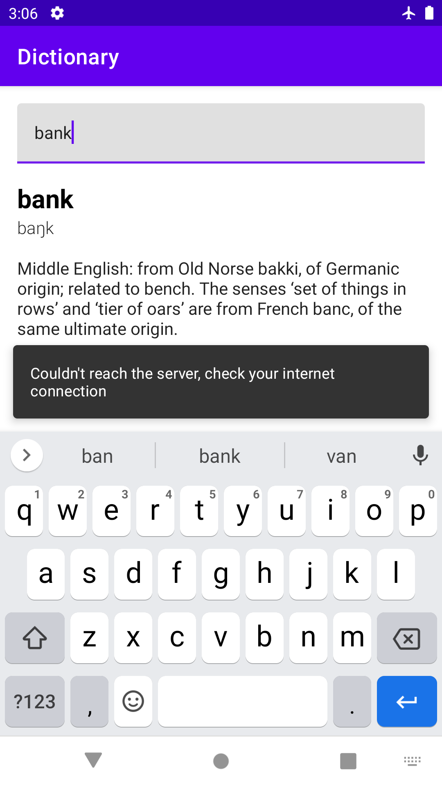

# Clean-Architicture-Dictionary

Android App to **Search** for `Words` and `Phrases` on internet to get its details from dictionary.


## You can:

* Search in your cached words from previous search.
* Search for new words and save it in cache automatically


## Getting Started

download the repo as zip file or you can clone it from link below:

```
https://github.com/Ahmed-P-Mostafa/Clean-Architicture-Dictionary.git
```


### How to use

 

https://user-images.githubusercontent.com/61784191/146677024-384d2d48-2bfb-454f-b208-d5721c80d78e.mp4


## Built with

* [Kotlin 1.5.10](https://kotlinlang.org/) - The programming languages used
* Jetpack Compose
* Clean Architecture
* MVVM - Design Pattern
* Hilt
* Kotlin Flow
* Room Database
* Kotlin Coroutines
* Retrofit

